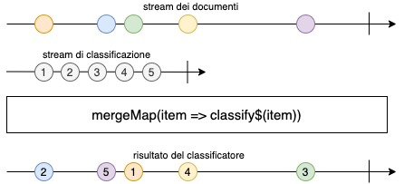

TextClassifier
============

Implementa un classificatore di testo che verrà usato nel progetto **Biblioteca di Babele** per assegnare il giusto codice Dewey (o un’altro tipo di classificazione biblioteconomica).

Un classificatore di testo è uno strumento che assegna ad un documento testuale una categoria presa da un insieme predefinito.

> Le categorie sono soltanto etichette simboliche testuali

Il classificatore utilizza l’apprendimento automatico (Machine Learning) con l’obbiettivo di trovare delle regole per discriminare i documenti passati in base alle classi di appartenenza.

L’apprendimento avviene addestrando precedentemente il classificatore con documenti per cui si conosce già la categoria a cui appartengono; da questo addestramento il classificatore troverà dei pattern o delle regole comuni per discriminare i nuovi documenti.

Formalmente, definiamo:

$$
{D} = \{{{d}_{1},{d}_{2}, … ,{d}_{|D|}}\}
$$

Un insieme di documenti iniziali;

$$
{C} = \{{{c}_{1},{c}_{2}, … ,{c}_{|C|}}\}
$$

Un insieme di categorie predefinite

e definiamo, una funzione:

$$
    \theta: {D} \times {C}  \to \{ {True}, {False} \}
$$

che prende un documento ${d} \in {D}$ e una categoria ${c} \in {C}$ e determina se deve o no appartenere a quella categoria. Questa è la funzione ottima, cioè la funzione ritorna il risultato corretto. Ovviamente una funzione che dia un risultato esatto e sempre corretto non è pensabile considerando la verità di documenti ci si potrebbero incontrare.

L’obbiettivo del classificatore è creare una funzione

$$
    \theta’: {D} \times {C}  \to \{ {True}, {False} \}
$$

che approssima il più possibile la funzione $\theta$ in modo da dare il risultato migliore.

Per poter analizzare efficacemente un documento trovando dei pattern comuni, il classificatore esegue una suddivisione del documento in caratteristiche che utilizzerà per classificare. Un esempio di suddivisione è per parole, cioè ogni parola del documento diviene una caratteristica del documento stesso, dal quale si possono togliere i duplicati e o le parole comuni che non identificano o caratterizzano il documento.

    "the quick rabbit jumps fances and jumps a shrubbery"
    ==remove stopwords=> "quick rabbit jumps fances jumps shrubbery"
    ==extract feature=> {"quick", "rabbit", "jumps", "fances", "shrubbery"}

Si possono usare altre tipologie di estrazione delle caratteristiche che più si prestano a caratterizzare la tipologia di documenti su cui il classificatore lavorerà.

## Algoritmi
Per la realizzazione di un classificatore si possono adoperare diverse tipologie di algoritmi che agiscono sul metodo di calcolo della probabilità che una determinata caratteristica di un documento appartenga a una caratteristica.
Esistono molti algoritmi di classificazione, quelli implementati in questo progetto sono:

#### **Naïve Bayes**
È basata sul calcolo della probabilità del numero di occorrenze di una caratteristica in un documento. L’aspetto principale dell’algoritmo è l’uso del teorema di Bayes che viene usato per calcolare la probabilità che una caratteristica appartenga o meno a una categoria, conoscendo la frequenza con cui quella caratteristica si presenta nei documenti (precedentemente allenati) e la percentuale di volte che quella caratteristica sia classificata con quella categoria.

Formalmente, sia ${x} \in {X}$ una caratteristica di un documento, con ${X}$ l’insieme delle caratteristiche e sia ${y} \in {C}$, allora il classificatore calcola:

${p}({y}|{x})$ cioè la probabilità condizionata di ${y}$ conoscendo ${x}$ è data dalla formula:

$$
{p}({y}|{x}) = \frac{{p}({x}|{y})}{{p}({x})} = \frac{{p}({x}|{y}){p}({y})}{\sum_{y’=1}^{C} {p}({x}|{y’}){p}({y’})}
$$

( ${p}({x})$ è la probabilità a priori)

#### **Fisher**
Il Metodo Fisher calcola la probabilità di una categoria per ogni caratteristica del documento, quindi combina queste probabilità di funzionalità e confronta quella probabilità combinata con la probabilità di un insieme casuale di caratteristiche.

//TODO: da aggiornare

## Estrattori di caratteristiche
Per poter ricavare delle regole o dei pattern da utilizzare per la classificazione di documenti, il classificatore necessita di un meccanismo per l’estrazione di caratteristiche che rappresentano il documento.
Il progetto prevede che questi meccanismi siano realizzati sotto forma di funzioni che prendono come argomento un documento e ritornino una mappa contenente la lista univoca di caratteristiche associate a un valore che ne assegna il peso che quella caratteristica possiede.

Una qualunque funzione dovrà assomigliare a questa firma

```typescript
declare featureFunctionExtractor(document: E): Map<string, number>
```

Dove ```E``` è la generica tipologia di un documento; mentre ```Map<string, number>``` sta a indicare ce la mappa delle caratteristiche sarà della forma

```
caratteristica: string
pesoCaratteristica: number
```

In questo momento si mette a disposizione le seguenti funzioni di estrazione delle caratteristiche:

* **getWords**:

```ts
declare getWords<E>(doc: E | string): Map<string, number>
```

Che prende un documento testuale, cioè formato da solo testo, lo spezza in singole parole, toglie le parole che non servono a caratterizzare un documento (come gli articoli, le preposizioni, ecc.) e genera, ritornandola, la lista in cui ogni parola diviene una caratteristica il cui peso è uguale per tutte.

Un esempio è il seguente:

```js
const features = getWords<string>("the quick rabbit jumps fances and jumps a shrubbery")

console.log(features)

// Result
// Map(5) { "quick" => 1, "rabbit" => 1, "jumps" => 1, "fances" => 1, "shrubbery" => 1 }
```

* **featureWthMetadata**

```ts
declare featureWthMetadata<E extends { metadata: { [a: string]: string }, content: string }>({ metadata, content }: E): Map<string, number>
```

Questa funzione prende un documento che deve avere obbligatoriamente almeno la proprietà ```metadata```, che contiene i metadati del documento nel formato ```{"metadato": "valore", …}``` e la proprietà ```content``` che contiene il contenuto testuale del documento. Dal documento così passato le caratteristiche che lo compongono saranno i valori dei metadati del documento a cui si uniscono le caratteristiche estratte dal contenuto procedendo come nel metodo **getWords**

Un esempio è il seguente:

```js
const document: Document = {
    metadata: {
        author: "William Shakespeare",
        date: "23/03/1616",
        title: "The Tragedy of Macbeth"
    },
    content: "the quick rabbit jumps fances and jumps a shrubbery",
    updateDate: "11/04/2019",
    link: "https://it.wikipedia.org/wiki/Macbeth"
}

const features = featureWthMetadata<Document>(document)

console.log(features)

// Result
// Map(5) { "william shakespeare" => 1, "23/03/1616" => 1, "the tragedy of macbeth" => 1, "quick" => 1, "rabbit" => 1, "jumps" => 1, "fances" => 1, "shrubbery" => 1 }
```


## Utilizzo del Classificatore
#### Creazione
Per poter utilizzare il classificatore bisogna creare una nuova istanza del classificatore scegliendo l’algoritmo che utilizzerà per fare la classificazione, per fare ciò si possano seguire due strade:

1. Creare direttamente l’istanza

```typescript
import NaiveBayes from '../src/algorithms/NaiveBayes'
import Fisher from '../src/algorithms/Fisher'

const classifier = new NaiveBayes<Document>(opt)

// oppure

const classifier = new Fisher<Document>(opt)
```

2. Creare tramite Factory

```typescript
import ClassifierFactory from '../src/ClassifierFactory'

const algoritm = 'NaiveBayes' // or 'Fisher'

const classifier = ClassifierFactory.create<Document>(algoritm, opt)
```

Per entrambi i metodi ogni classificatore prende opzionalmente come opzioni:

```js
{
  features?: "Funzione per l'estrazione delle caratteristiche"
  database?: {
    dbPath: "percorso al database"
  }
}

// ? sta a indicare l'opzionalità dell'opzione
```


> Nota: Il classificatore utilizza un database SQLite

#### Addestramento
Per poter funzionare il classificatore ha bisogno di un addestramento.
> Qualora si stesse usando un database, ogni addestramento viene conservato e utilizzato per ogni nuova istanza o esecuzione.

Per addestrare il classificatore basta eseguire il codice:

```js
    // …
    await classifier.train(doc, tag)

    // Ad esempio

    await cl.train('the quick rabbit jumps fances', 'good')
    await cl.train('buy pharmaceuticals now', 'bad')
    await cl.train('make quick money at the online casino', 'bad')
```

che permette di assegnare a quel documento il tag.
La funzione ritorna una ```Promise``` vuota

#### Classificazione
Una volta addestrato il proprio classificatore lo si può usare per ipotizzare il tag più probabile per un nuovo documento

```javascript
const tag = classifier.classify(newdoc)

// Esempio
const tag = classifier.classify('the quick brown fox jumps')
console.log(tag) // good

const tag = classifier.classify('get money with trading online')
console.log(tag) // bad
```


#### Un esempio completo

```js
import ClassifierFactory from '../src/ClassifierFactory'

(async function main() {
    // Create
    const classifier = ClassifierFactory.create<Document>('Fisher')
    // Train
    await cl.train('the quick rabbit jumps fances', 'good')
    await cl.train('buy pharmaceuticals now', 'bad')
    await cl.train('make quick money at the online casino', 'bad')

    // Classify
    const tag = classifier.classify('get money with trading online')

    console.log(tag) // Print: bad
})()
```

## Versione funzionale
Per questa versione si da per scontato che il classificatore utilizzi un database e che sia già stato addestrato.

Il repository mette a disposizione una funzione che classifica i documenti evitando l'utilizzo di classi e istanze. Per utilizzarla basta importare la funzione.

Questa funzione è "currificata". Questo comporta la possibilità di passare gli argomenti uno alla volta. Per precisazioni, si veda [qui](https://stackoverflow.com/questions/36314/what-is-currying)

```js
import classify from './src/fp'
// ...
const classifyFisher = classify({
  algorithm: 'Fisher'
  dbPath: 'path/to/db'
})
// ...
const doc = 'get money with trading online'
// ...
const classResult = await classifyFisher(doc)
console.log(classResult) // 'bad'
```


## Utilizzo con i Node Cluster Workers
**Per usare questa funzionalità occorre NodeJs >10**

Il classificatore, se allenato con molti documenti (necessario per avere classificazioni il più attendibili possibili) potrebbe richiedere tempo e risorse macchina onerose; per risolvere questo inconveniente si è messo a disposizione una versione del classificatore che fa uso di processi figli per poter eseguire in parallelo più classificazioni senza impattare sulle risorse del singolo thread in cui il programma gira.

Questa versione funziona nella falsa riga della versione funzionale. Occorre però fare una precisazione: siccome non è possibile garantire che più classificazioni in parallelo concludano in ordine, occorre passare un identificativo insieme al documento da classificare, così da avere nella risposta un riscontro di quale documento, la risposta del classificatore, si riferisce. Cioè invece che ritornare il risultato della classificazione, ma ritorna una coppia ```[identificativo del documento, risultato della classificazione]```.

Per usare questa versione si può procedere come segue:

```js
import classify from './src/worker'
// ...
const classifyFisher = classify({
  algorithm: 'Fisher'
  dbPath: 'path/to/db'
})
// ...
// Create a list of documents
const documents = [
    { id: 1, doc: doc1 },
    { id: 2, doc: doc2 },
    { id: 3, doc: doc3 },
    { id: 4, doc: doc4 },
]
// ...
// For every documents run the classification and return the promise
const runClassify = documents.map(([id, doc]) => {
    return classify(id, doc)
})
// Wait that all classification ends
const results = await Promise.all(runClassify)
console.log(results)
/* example of results
[
    [2, 'bad'],
    [3, 'good'],
    [1, 'good'],
    [4, 'bad']
]
*/
```

Dove ```doc*``` identifica un qualsiasi documento da classificare.

## Classificatore con RxJs e i Node Cluster Workers
Un’ulteriore modalità di classificazione messa a disposizione combina l’utilizzo dei Node Cluster Workers e gli stream di dati gestiti con la libreria RxJs.

Questa versione permette di utilizzare il classificatore come operatore di RxJs nel restante progetto **Biblioteca di Babele** che fa molto uso degli stream e RxJs.

Questa versione non fa altro che trasformare le promise della versione con i Node Cluster Workers in uno stream di dati. Cioè permette, dato uno stream di documenti (con il loro identificativo) di trasformare ogni evento dello stream nella versione classificata.



L’utilizzo è semplice, definito lo stream dei documenti, si definisce lo stream di classificazione, impostando l’algoritmo e le altre impostazioni (si ricorda che per funzionare il classificatore deve usare il database per registrare gli addestramenti e deve essere precedentemente addestrato); infine lo si mette in pipe i due stream e ci si può registrare per recuperare il risultato della classificazione per ogni documento dello stream.

Esempio:

```ts
import classify from '../src/stream' // classifier stream

import { of } from 'rxjs'
import { mergeMap } from 'rxjs/operators'

// Define the document stream
const document$ = of(
    ['id', doc1],
    ['id2', doc2],
    ['id3', doc3],
    ['id4', doc4],
    ['id5', doc5]
)

// import classifier stream
const classify$ = classify<Document>({
    dbPath: 'path/to/db',
    algorithm: 'Fisher'
})

// new piped stream
const piped$ = document$.pipe(
    mergeMap(([id, item]) => {
      return classify$(id, item)
    })
)

// now you can subscribe on that stream
piped$.subscribe(resultOfClassifier => {
    const [id, result] = resultOfClassifier
    console.log(id, result)
})
/* print
$> id2, 'bad'
$> id5, 'bad'
$> id1, 'good'
$> id4, 'bad'
$> id3, 'good'
*/
```

> ```$``` sta a indicare che quella variabile contiene uno stream di dati

Si è messo anche a disposizione di un operatore che aggrega e snellisce la precedente procedura di pipe.

```ts
import { mergeClassify } from '../src/stream' // classifier stream

// …
const piped$ = document$.pipe(mergeClassify<Document>({
    dbPath: 'path/to/db',
    algorithm: 'Fisher'
}))
// …
```


Grazie 🙏
